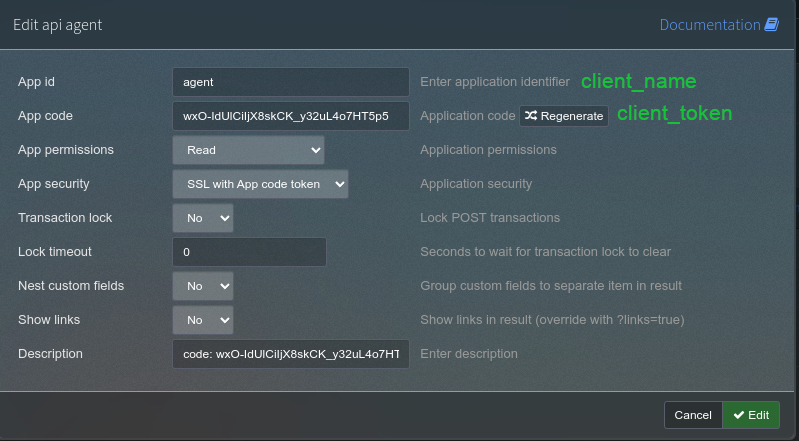
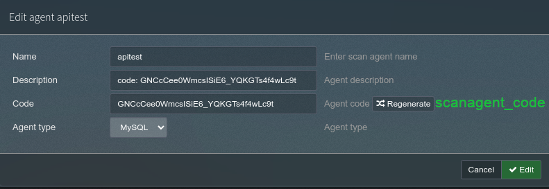

The Scan Agent Scanner component is intended to scan networks that are assigned to it by the phpIPAM server. It can be installed and ran from any host that is capable of running python.


## Usage

After installing the collection and configuring. Running the agent is as simple as running the following command:

``` bash

ansible-playbook nofusscomputing.phpipam_scan_agent.agent

```

_See below for the variable details_


### phpIPAM API

The scanner component requires API access to phpIPAM. THe API user that is used, must only be given read only access to the API.


### Variables

Variables for the scanner are set in a variables file at path `/etc/phpipam/scan_agent.yaml`. The variables described below, if optional the value specified here is the default value.

``` yaml
nofusscomputing_phpipam_scan_agent:

  api_url:                           # Mandatory, String. url with protocol of the phpIPAM API to connect to.

  http_port: 5000                    # Optional, Integer. http port to connect to the server.
  http_server: http://127.0.0.1      # Optional, Integer. url with protocol of the Scan Server to connect to.
  auth_token:                        # Optional, String. The Scan-Agent server authentication token.
  ca_path:                           # Optional, String. PEM formatted file that contains a CA certificate to be used for validation

  cache_expire_time: 1800            # Optional, Integer. Time in seconds to expire the phpIPAM cache.
  epoch_time_offset: 0               # optional, int. Value in seconds to offset the time

# phpIPAM Scan Agent Settings
  client_token:                      # Mandatory, String client api token to connect to phpIPAM API [client_token]
  client_name:                       # Mandatory, String. The scanner name as set in phpIPAM interface [client_name]
  scanagent_code:                    # Mandatory, String. Scan Agent Code as set in phpIPAM interface [scanagent_code]


```

!!! tip
    You can specify environmental variable `ANSIBLE_LOG_PATH=/var/log/ansible.log`, which will tell the scanner component to log to a file at path `/var/log/ansible.log`


#### phpIPAM Interface variable Mapping

These images are of the phpIPAM interface that show in green text the variable name that would be set as detailed above.


phpIPAM API Settings

----


phpIPAM Scan Agent Settings


## Workflow

The scanner component has the following workflow:

1. Expire cache, if cache expiry has elapsed.

1. Fetch from the phpIPAM API, the subnets assigned to it. _results are cached_

1. Fetch ALL address' from phpIPAM API, that are assosiated with agent subnets. _results are cached_

1. For each network:

    1. conduct Scan of network.

        !!! info
            The following details are included in the scan report:
    
            - IP Address
    
            - MAC Address* _Only if the scanner is on the same L2 network (Broadcast Domain)_

    1. Re-format nmap scan report to format Server component recognizes.

    1. upload scan report to configured Server.

1. workflow complete.


## Remote network Scannning

Once the [server component](server.md#remote%20network%20scannning) has been setup, the client can be installed/used from any network. Even a network that is isolated from the server. Only caveat is that the client can communicate with the server. To ensure that the client can connect to the server set the `auth_token` to match that of the server.

Confirmation of the servers identity is done by validating the certificate that the server is using for TLS. Set variable `ca_path` to the path of a PEM formated certificate, and the CA certificate that was used to sign the servers TLS certificate.

!!! tip
    Whilst it's possible to use a certificate from a provider, letsencrypt for example. Using a self signed certificate is advised for communication between the server and scanner components. By doing so only you can authorize a certificate for the server. You should assess what is the best course of action within your threat model.

!!! danger "Security"
    Failing to secure the server component communication with TLS will allow anyone with direct access to the line of communication to view the `auth_token`. Anyone who has the `auth_token` will be able to upload data to the server.

    In an attempt to mitigate this, the scanner will fail to communicate with the server if you have set an `auth_token` and attempt non-TLS communication with the server.
